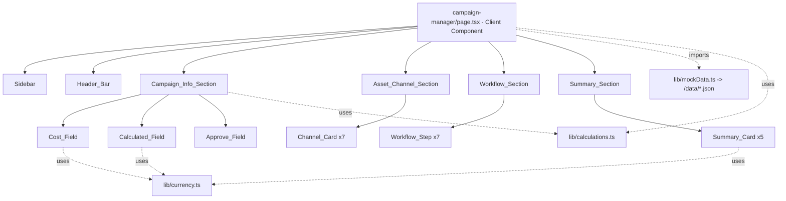

# Design Document

## Overview

The Campaign Manager Dashboard is a frontend-only page added to the existing Next.js 14 (App Router) + TypeScript + Tailwind CSS project. It delivers a single desktop-first workspace composed of a left navigation **Sidebar**, a top **Header_Bar**, and four stacked card-based content sections:

- **Section A — Campaign_Info_Section** ("Informasi Campaign"): a cost-detail form with automatic Margin and NPM calculation.
- **Section B — Asset_Channel_Section** ("Asset & Channel"): seven channel sub-cards.
- **Section C — Workflow_Section** ("Workflow Campaign"): a horizontal 7-step workflow visualization.
- **Section D — Summary_Section** ("Status & Ringkasan"): five summary metric cards.

The page is implemented as a new App Router route, `app/campaign-manager/page.tsx`, rendered as a Client Component because all interactivity (form input, active nav item, filters, search, calculation) lives in local component state. All displayed content is sourced from typed **Mock_Data** modules whose shapes mirror the existing `app/api` response structures, so a backend route can later return the same structures without changing consuming components.

This phase introduces **no new runtime dependencies**. It reuses existing conventions: the light SaaS theme (`bg-slate-50` body), KALOVA branding, indigo/violet accents (Tailwind `indigo`/`violet`), card-based layouts with rounded corners, and the mock-data pattern under `/data` served by thin `app/api/*` route handlers.

### Design Goals

1. **Component reusability (Req 10):** `Sidebar`, `Header_Bar`, `Channel_Card`, `Workflow_Step`, and `Summary_Card` are standalone, prop-driven components with no hard-coded campaign/channel/workflow/summary text.
2. **Backend-ready data models (Req 10.4):** TypeScript interfaces match `app/api` response shapes.
3. **Correct, testable calculations (Req 5):** Margin/NPM and Rupiah formatting/parsing live in pure utility functions that are unit- and property-tested independently of React.
4. **Graceful empty states (Req 1.8, 7.12, 8.7, 9.7, 10.5):** every section renders its container and a placeholder when data is missing.
5. **Responsive layout (Req 1.5–1.7):** desktop (>=1024) side-by-side, tablet (768–1023) single column, mobile (<768) stacked single column, no horizontal page scrollbar at any breakpoint.

### Research Notes

- **Project stack:** `package.json` confirms Next.js `14.2.15`, React `18.3.1`, Tailwind `3.4.6`, TypeScript `5.5.3`, with **no test tooling installed**. The Testing Strategy below specifies adding a test runner (Vitest) plus a property-based testing library (fast-check) as dev dependencies, since the calculation/formatting logic is a strong PBT candidate.
- **Existing API/data pattern:** each `app/api/<name>/route.ts` reads a JSON file from `/data` via `fs.readFileSync` and returns it with `NextResponse.json(...)`. New mock data follows the same `/data/*.json` + `app/api/*/route.ts` convention so the dashboard can switch from local imports to `fetch` later with no shape changes.
- **Existing types:** `data/products.json` items already use camelCase cost keys (`hpp`, `hargaJual`, `adminFee`, `shippingFee`, `margin`, `npm`). The campaign cost model reuses and extends these key names to stay consistent with the existing product shape.
- **Reusable UI:** `components/CreatableSelect.tsx` is a controlled select with an "add new" affordance; the existing `app/promo-dashboard/page.tsx` already demonstrates a sidebar + header + violet-accent active state pattern (`bg-[#7c3aed]`). The dashboard mirrors that interaction model but in the light theme.
- **Path alias:** `tsconfig.json`/imports use `@/` (e.g. `@/components/RoleContext`), so new modules use the same alias.

## Architecture

### Route and Rendering Strategy

```
app/campaign-manager/page.tsx      <- 'use client' page; owns top-level state, composes sections
```

The page is a Client Component (`'use client'`) because Requirements 2, 3, 4, 5, and 6 require interactive local state. It imports Mock_Data directly from `/data` modules through typed loader functions in `lib/`, keeping data access in one place so it can be swapped for `fetch('/api/...')` later without touching components.



### Layered Responsibilities

| Layer | Location | Responsibility |
|-------|----------|----------------|
| Page/container | `app/campaign-manager/page.tsx` | Owns top-level state (active nav item, month/year filters, search keyword, campaign rows), loads Mock_Data, composes sections. |
| Section components | `components/dashboard/*` | Layout + empty-state handling for each section; receive data via props. |
| Reusable leaf components | `components/dashboard/*` | `Sidebar`, `HeaderBar`, `ChannelCard`, `WorkflowStep`, `SummaryCard`, `CostField`, `CalculatedField`, `ApproveField`. |
| Pure logic utilities | `lib/calculations.ts`, `lib/currency.ts` | Margin/NPM math, Rupiah formatting and input parsing. **No React, fully testable.** |
| Data loaders + types | `lib/mockData.ts`, `lib/types.ts` | Typed access to Mock_Data; types mirror `app/api` shapes. |
| Mock data | `data/*.json` + `app/api/*/route.ts` | Static dummy data and optional matching route handlers. |

### Layout Strategy (Requirement 1)

The page uses a CSS fl/grid layout driven by Tailwind responsive utilities:

- **Desktop (>=1024, `lg:`):** `lg:flex-row` — Sidebar fixed-width column (`lg:w-60`) always visible beside the content area (`flex-1`). (Req 1.5)
- **Tablet (768–1023, `md:`):** Sidebar collapses above content; content sections render in one vertical column. Overflow controlled with `overflow-x-hidden` on the page wrapper to guarantee no horizontal page scrollbar. (Req 1.6)
- **Mobile (<768, base):** Sidebar and content stack vertically; sections in a single column; `overflow-x-hidden` on wrapper. (Req 1.7)

Sections always render in fixed top-to-bottom order A → B → C → D inside the content area (Req 1.3), each as a rounded card (`rounded-xl bg-white border border-slate-200 shadow-sm`). The body background stays light (`bg-slate-50` from `globals.css`), and violet accents (`violet-600`/`indigo-600`) mark interactive/active elements (Req 1.4).

Note: horizontal scrolling is permitted *within* the Workflow_Section only (Req 8.6), implemented as an inner `overflow-x-auto` container; it does not affect the overall page layout.

## Components and Interfaces

All components are prop-driven (Req 10.1, 10.2). Content is passed in; none is defined internally.

### Page Component — `app/campaign-manager/page.tsx`

Owns the following local state (Req 4.8, 6.4 — session-scoped, cleared on reload, Req 4.9):

```ts
const [activeNavItem, setActiveNavItem] = useState<NavItemId>('dashboard'); // Req 2.3
const [month, setMonth] = useState<number>(getCurrentMonth());             // Req 3.6
const [year, setYear] = useState<number | null>(getMostRecentYear(years)); // Req 3.6
const [search, setSearch] = useState<string>('');                          // Req 3.9
const [rows, setRows] = useState<CampaignRow[]>(initialRows);              // Req 4.8, 6.5
```

### Sidebar — `components/dashboard/Sidebar.tsx`

```ts
interface NavItem {
  id: string;     // stable identifier, e.g. "dashboard"
  label: string;  // display text, e.g. "Dashboard"
}

interface SidebarProps {
  title: string;            // "Navigasi" (Req 2.1)
  items: NavItem[];         // exactly 9 items, ordered (Req 2.2)
  activeId: string;         // currently active nav item id (Req 2.4)
  onSelect: (id: string) => void; // Req 2.5, 2.7
}
```

Behavior: renders `title`, maps `items` to buttons, applies the violet accent class to the button whose `id === activeId` (Req 2.6). Selecting an item calls `onSelect`; selecting the active item is a no-op visually because `activeId` is unchanged (Req 2.7). Exactly one item is active because `activeId` is a single value (Req 2.4).

### Header_Bar — `components/dashboard/HeaderBar.tsx`

```ts
interface HeaderBarProps {
  title: string;                 // "Campaign Manager" (Req 3.1)
  months: { value: number; label: string }[]; // 12 months (Req 3.3)
  years: number[];               // distinct, ascending, de-duplicated (Req 3.4, 3.5)
  selectedMonth: number;
  selectedYear: number | null;
  search: string;
  addButtonLabel: string;        // "+ Tambah Campaign" (Req 11)
  onMonthChange: (m: number) => void;
  onYearChange: (y: number) => void;
  onSearchChange: (keyword: string) => void; // enforces <=100 chars (Req 3.9, 3.10)
  onAddCampaign: () => void;
}
```

Controls render left-to-right: Month_Filter, Year_Filter, Search_Field, Add_Campaign_Button (Req 3.2). The Search_Field clamps input to 100 characters via `clampSearch` before calling `onSearchChange` (Req 3.10). When `years` is empty the Year_Filter renders with no options but stays enabled (Req 3.5).

### Campaign_Info_Section — `components/dashboard/CampaignInfoSection.tsx`

Renders the title "Informasi Campaign" (Req 4.1) and a two-row field grid (Req 4.2, 4.3). It receives one or more `CampaignRow` values and renders each row's fields, delegating:

- Cost inputs → `CostField` (Req 4.4–4.7)
- Margin/NPM → `CalculatedField` (read-only, Req 5.1)
- Approve → `ApproveField` (Req 6)

Margin/NPM are derived on each render from the row's cost values via `lib/calculations.ts`; no derived value is stored in state, guaranteeing recomputation within the required time bounds (Req 5.2, 5.3).

```ts
interface CostFieldProps {
  label: string;
  value: number | null;            // raw numeric value in state
  onChange: (value: number | null) => void;
  max?: number;                    // default 999_999_999_999 (Req 4.5)
}

interface CalculatedFieldProps {
  label: string;                   // "Margin" | "NPM"
  displayValue: string;            // pre-formatted via currency utils
  readOnly: true;                  // Req 5.1
}

interface ApproveFieldProps {
  value: ApprovalStatus;           // "Pending" | "Approved" | "Rejected"
  options: ApprovalStatus[];       // sourced from Mock_Data (Req 6.1)
  onChange: (next: ApprovalStatus) => void; // rejects invalid (Req 6.6)
}
```

`CostField` keeps a raw numeric value in state and shows the formatted Rupiah string for display (Req 4.5); keystrokes pass through `parseRupiahInput` to strip non-digits (Req 4.6); an empty field shows no "Rp" prefix (Req 4.7).

### Asset_Channel_Section — `components/dashboard/AssetChannelSection.tsx` + `ChannelCard.tsx`

```ts
interface ChannelDetail {
  label: string;
  value: string | null;   // null/empty -> "-" placeholder (Req 7.12)
}

interface Channel {
  id: string;
  name: string;            // "Tab Promo", "Banner", ...
  icon: string;            // icon key/name (Req 7.10)
  details: ChannelDetail[]; // label/value pairs (Req 7.3–7.9, 7.11)
}

interface ChannelCardProps { channel: Channel; }
```

The section renders the heading "Asset & Channel" (Req 7.1) and maps the Mock_Data channel list to exactly 7 `ChannelCard`s in fixed order (Req 7.2). Each card renders an icon + name (Req 7.10) and its detail label/value pairs (Req 7.11), substituting "-" when a value is empty (Req 7.12).

### Workflow_Section — `components/dashboard/WorkflowSection.tsx` + `WorkflowStep.tsx`

```ts
interface WorkflowStepModel {
  order: number;   // 1..7
  name: string;    // "Brief Campaign", ...
  icon: string;
}

interface WorkflowStepProps {
  step: WorkflowStepModel;
  showConnector: boolean; // true for steps 2..7 to render the inbound connector (Req 8.4)
}
```

Renders the title "Workflow Campaign" (Req 8.1) and arranges steps in a single horizontal row in order 1→7 (Req 8.2, 8.3) inside an `overflow-x-auto` track that enables horizontal scrolling when content exceeds width without truncating names (Req 8.6). Six directional connectors are rendered between consecutive steps (Req 8.4). If the step set is empty, the section shows an "unavailable" message instead of an empty/partial row (Req 8.7).

### Summary_Section — `components/dashboard/SummarySection.tsx` + `SummaryCard.tsx`

```ts
type SummaryFormat = 'number' | 'rupiah' | 'percent1';

interface SummaryMetric {
  id: string;
  label: string;                 // "Total Campaign", ...
  icon: string;
  value: number | null;          // null -> placeholder, omit trend (Req 9.7)
  format: SummaryFormat;         // controls formatting (Req 9.5, 9.6)
  trend?: { change: number; period: string }; // signed change + period (Req 9.3)
}

interface SummaryCardProps { metric: SummaryMetric; }
```

Renders the title "Status & Ringkasan" (Req 9.1) and exactly five cards in fixed order (Req 9.2). Each card renders icon, label, primary number, and a trend note (Req 9.3). "Budget Terpakai" formats as Rupiah (Req 9.5); "Margin Rata-rata" formats as percent with one decimal, comma decimal separator, "%" suffix (Req 9.6). When `value` is null the card shows a placeholder and omits the trend note (Req 9.7).

### Reusable Logic Utilities

`lib/currency.ts`:

```ts
// Formats an integer Rupiah amount: "Rp" prefix, "." thousands sep, no decimals.
// Negative values keep a leading minus sign (Req 4.5, 5.8, 5.9, 9.5).
export function formatRupiah(amount: number): string;

// Parses raw input into digits-only numeric value; empty -> null (Req 4.6, 4.7).
export function parseRupiahInput(raw: string): number | null;

// Formats a ratio as percent with 1 decimal, comma decimal separator, "%" (Req 9.6).
export function formatPercent1(value: number): string;

// Clamps a search keyword to at most 100 characters (Req 3.10).
export function clampSearch(raw: string): string;
```

`lib/calculations.ts`:

```ts
export interface CostComponents {
  hpp: number | null;
  adminFee: number | null;
  shippingFee: number | null;
  promoXtra: number | null;
  feePerPesanan: number | null;
  campaignFee: number | null;
  promosiFee: number | null;
  marketingFee: number | null;
  adsSpending: number | null;
  affiliateCommission: number | null;
  operatingCost: number | null;
}

// Margin = hargaJual - sum(11 cost components); null/non-numeric treated as 0 (Req 5.4, 5.6).
export function computeMargin(hargaJual: number | null, costs: CostComponents): number;

// NPM = (margin / hargaJual) * 100, rounded to 2 dp; returns 0 when hargaJual <= 0 (Req 5.5, 5.7).
export function computeNpm(margin: number, hargaJual: number | null): number;

// NPM display string with "%" suffix; "0%" when hargaJual is 0/empty (Req 5.7).
export function formatNpm(margin: number, hargaJual: number | null): string;
```

## Data Models

All models live in `lib/types.ts`. They mirror the existing `app/api` response shapes (Req 10.4): cost keys reuse the camelCase names already present in `data/products.json` (`hpp`, `hargaJual`, `adminFee`, `shippingFee`, ...), extended with the remaining campaign cost components.

```ts
// ---- Campaign cost row (Section A) ----
export type ApprovalStatus = 'Pending' | 'Approved' | 'Rejected';

export interface CampaignRow {
  id: string;
  idProduk: string;
  namaProduk: string;
  kategori: string;
  // 12 cost fields (Req 4.4); null = empty, treated as 0 in calc (Req 5.6)
  hpp: number | null;
  hargaJual: number | null;
  adminFee: number | null;
  shippingFee: number | null;
  promoXtra: number | null;
  feePerPesanan: number | null;
  campaignFee: number | null;
  promosiFee: number | null;
  marketingFee: number | null;
  adsSpending: number | null;
  affiliateCommission: number | null;
  operatingCost: number | null;
  // Margin & NPM are DERIVED, not stored (Req 5.1) — computed on render.
  approve: ApprovalStatus; // stored per-row (Req 6.4, 6.5)
}

// ---- Navigation (Section: Sidebar) ----
export interface NavItem { id: string; label: string; }

// ---- Channels (Section B) ----
export interface ChannelDetail { label: string; value: string | null; }
export interface Channel { id: string; name: string; icon: string; details: ChannelDetail[]; }

// ---- Workflow (Section C) ----
export interface WorkflowStepModel { order: number; name: string; icon: string; }

// ---- Summary (Section D) ----
export type SummaryFormat = 'number' | 'rupiah' | 'percent1';
export interface SummaryTrend { change: number; period: string; }
export interface SummaryMetric {
  id: string;
  label: string;
  icon: string;
  value: number | null;
  format: SummaryFormat;
  trend?: SummaryTrend;
}

// ---- Filters ----
export interface MonthOption { value: number; label: string; }
```

### Mock Data Modules

Following the existing `/data/*.json` + `app/api/*/route.ts` convention, new data files are added and read through a single typed loader (`lib/mockData.ts`). The loader can later be swapped to `fetch('/api/<name>')` without changing component props.

| Mock data file | Type | Consumed by | Matching route (optional) |
|----------------|------|-------------|----------------------------|
| `data/nav-items.json` | `NavItem[]` | Sidebar (Req 2.2) | — |
| `data/channels.json` | `Channel[]` | Asset_Channel_Section (Req 7) | `app/api/channels/route.ts` |
| `data/workflow-dashboard.json` | `WorkflowStepModel[]` | Workflow_Section (Req 8) | reuses `app/api/workflow-steps` pattern |
| `data/summary.json` | `SummaryMetric[]` | Summary_Section (Req 9) | `app/api/summary/route.ts` |
| `data/approval-status.json` | `ApprovalStatus[]` | Approve_Field (Req 6.1) | `app/api/options` pattern |
| `data/campaign-years.json` | `number[]` | Year_Filter (Req 3.4) | — |

`lib/mockData.ts` exposes typed getters, e.g.:

```ts
export function getNavItems(): NavItem[];
export function getChannels(): Channel[];
export function getWorkflowSteps(): WorkflowStepModel[];
export function getSummaryMetrics(): SummaryMetric[];
export function getApprovalStatuses(): ApprovalStatus[];
export function getCampaignYears(): number[];        // raw years (may contain duplicates)
export function getDistinctSortedYears(): number[];  // Req 3.4: distinct + ascending
```

### Derived-Value Rule

Margin and NPM are **never** persisted in `CampaignRow`. They are computed from the row's cost fields during render via `computeMargin`/`computeNpm`. This guarantees the displayed value is always consistent with the current inputs (Req 5.2, 5.3) and removes any possibility of stored-vs-displayed drift.

## Correctness Properties

*A property is a characteristic or behavior that should hold true across all valid executions of a system — essentially, a formal statement about what the system should do. Properties serve as the bridge between human-readable specifications and machine-verifiable correctness guarantees.*

This feature is a strong fit for property-based testing because the calculation and formatting logic (`lib/calculations.ts`, `lib/currency.ts`) and a few small state reducers are **pure functions** with large input spaces and clear universal contracts. Layout, fixed labels, theming, and ordering are validated with example-based render tests instead (see Testing Strategy). The following properties were derived from the prework analysis after consolidating redundant criteria.

### Property 1: Rupiah formatting round-trip and grouping

*For any* integer amount `n` with `-999,999,999,999 <= n <= 999,999,999,999`, `formatRupiah(n)` begins with the `Rp` marker, groups the digits of `|n|` into sets of three separated by a period, includes no decimal portion, prepends a leading minus sign when `n` is negative, and the digits extracted from the output re-parse to `|n|`.

**Validates: Requirements 4.5, 5.8, 5.9, 9.5**

### Property 2: Rupiah input parsing keeps only digits

*For any* string `s`, `parseRupiahInput(s)` returns the numeric value formed by the digit characters of `s` in order, and returns `null` when `s` contains no digit characters (including the empty string).

**Validates: Requirements 4.6, 4.7**

### Property 3: Margin equals Harga Jual minus the sum of cost components, treating missing values as zero

*For any* `hargaJual` and any set of the eleven cost components where each value is a number or `null`, `computeMargin(hargaJual, costs)` equals `(hargaJual ?? 0)` minus the sum of the eleven components with every `null`/non-numeric value treated as `0`. Equivalently, replacing any component with `null` yields the same result as replacing it with `0`.

**Validates: Requirements 5.4, 5.6**

### Property 4: NPM formula with zero-guard

*For any* `margin` and `hargaJual`, when `hargaJual` is a positive number `formatNpm(margin, hargaJual)` equals `(margin / hargaJual) * 100` rounded to two decimal places followed by `%`; and when `hargaJual` is `0`, `null`, or non-numeric, `formatNpm` returns exactly `"0%"`.

**Validates: Requirements 5.5, 5.7**

### Property 5: Percentage formatting shape

*For any* finite non-negative number `x`, `formatPercent1(x)` renders `x` rounded to exactly one decimal place using a comma as the decimal separator and a `%` suffix, and the value re-parsed from the output equals `x` rounded to one decimal place.

**Validates: Requirements 9.6**

### Property 6: Search keyword clamping

*For any* string `s`, `clampSearch(s)` returns a string of length `min(length(s), 100)` that equals the first 100 characters of `s`, never exceeding 100 characters.

**Validates: Requirements 3.9, 3.10**

### Property 7: Year options are distinct, ascending, and default to the most recent

*For any* array of year numbers (in any order, possibly containing duplicates or empty), `getDistinctSortedYears` returns a strictly ascending array containing exactly the distinct values of the input; and when the input is non-empty the default selected year equals the maximum value, while an empty input yields an empty option list with no error.

**Validates: Requirements 3.4, 3.5, 3.6**

### Property 8: Exactly one navigation item is active

*For any* sequence of navigation selections applied to the sidebar state starting from the default, exactly one Nav_Item is active at all times, and after each selection the active Nav_Item is the most recently selected id (selecting the already-active item leaves the active id unchanged).

**Validates: Requirements 2.4, 2.5, 2.7**

### Property 9: Per-row approval status independence

*For any* collection of campaign rows and any single row, changing that row's approval status leaves the approval status of every other row unchanged.

**Validates: Requirements 6.5**

### Property 10: Invalid approval status is rejected

*For any* string value, applying it as an approval status updates the stored value only when it is one of `"Pending"`, `"Approved"`, or `"Rejected"`; any other value is rejected and the previously stored status is retained.

**Validates: Requirements 6.6**

### Property 11: Workflow connector count

*For any* non-empty list of `N` workflow steps, the Workflow_Section renders exactly `N - 1` directional connectors (and `0` connectors when the list is empty).

**Validates: Requirements 8.4**

### Property 12: Channel card renders every detail with placeholder substitution

*For any* channel with an arbitrary list of detail label/value pairs, the rendered Channel_Card contains every detail label, and for each detail displays its value when present or the `"-"` placeholder when the value is empty, null, or unavailable.

**Validates: Requirements 7.11, 7.12**

### Property 13: Sections render with an empty-state placeholder and never crash on empty data

*For any* section (Campaign_Info, Asset_Channel, Workflow, or Summary) supplied with an empty or missing data collection, the section renders its card-based container without throwing, displays an empty-state placeholder, and the four sections preserve their A→B→C→D order; for the Summary_Card specifically, a missing primary value renders a placeholder and omits the trend note.

**Validates: Requirements 1.8, 7.12, 8.7, 9.7, 10.5**

## Error Handling

The dashboard is a client-rendered, frontend-only feature with no network calls in this phase, so error handling focuses on invalid input, missing data, and defensive rendering rather than transport failures.

| Condition | Handling | Requirement |
|-----------|----------|-------------|
| Non-numeric characters typed into a Cost_Field | `parseRupiahInput` strips non-digits; only digits retained in state | 4.6 |
| Cost_Field cleared / empty | Stored as `null`, displayed empty with no `Rp` prefix; treated as `0` in calculations | 4.7, 5.6 |
| Cost value out of range (> 999,999,999,999) | Input clamped to the max before formatting | 4.5 |
| `Harga Jual` is `0`, empty, or non-numeric | NPM short-circuits to `"0%"` (no division by zero) | 5.7 |
| Negative computed Margin | Rendered with a leading minus sign, Rupiah formatting retained | 5.9 |
| Search keyword exceeds 100 characters | `clampSearch` truncates to first 100 characters | 3.10 |
| `Year_Filter` data empty | Renders no options, control stays enabled, no thrown error | 3.5 |
| Invalid approval status value | Rejected; previous value retained; visible indication shown (e.g., the control reverts and a small inline note/aria-live message) | 6.6 |
| Any section's Mock_Data missing or empty collection | Section container still renders with an empty-state placeholder; no runtime error; section order preserved | 1.8, 7.12, 8.7, 9.7, 10.5 |
| Channel detail value empty/unavailable | `"-"` placeholder rendered in place of the value | 7.12 |

Defensive rendering rules:

- All list-rendering sections guard against `undefined`/empty arrays before mapping (`(items ?? []).length === 0` → empty-state branch).
- Calculation utilities accept `number | null` and normalize with a single internal `toNumber(v)` helper that maps `null`/`NaN`/non-finite values to `0`, ensuring no `NaN` propagates to the UI.
- Display formatters never throw on edge inputs (empty, zero, negative, max); they return well-defined strings.

## Testing Strategy

### Tooling

No test tooling is currently installed. This feature adds, as dev dependencies:

- **Vitest** — test runner compatible with the Next.js/TypeScript setup.
- **fast-check** — property-based testing library for TypeScript/JavaScript. We will **not** implement property testing from scratch.
- **@testing-library/react** + **jsdom** — for component render/interaction tests of the prop-driven components.

Tests are run in single-run (non-watch) mode, e.g. `vitest --run`.

### Dual Testing Approach

**Unit / example-based tests** cover the fixed, non-varying criteria:

- Fixed titles and labels: "Navigasi" (2.1), "Campaign Manager" (3.1), "+ Tambah Campaign" (3.11), "Informasi Campaign" (4.1), "Asset & Channel" (7.1), "Workflow Campaign" (8.1), "Status & Ringkasan" (9.1).
- Fixed counts and ordering: 9 nav items (2.2), control order (3.2), 12 months (3.3), field rows (4.2, 4.3), 7 channel cards and their specific detail labels (7.2–7.9), 7 workflow steps named/ordered (8.2, 8.3), 5 summary cards ordered (9.2).
- Defaults: active "Dashboard" on load (2.3), default month/year (3.6), default approval "Pending" (6.2).
- Styling/structure smoke checks: violet accent on active nav item (2.6), light theme + rounded cards (1.4), responsive class presence per breakpoint (1.5–1.7), horizontal scroll container on workflow overflow (8.6).
- Read-only state of Margin/NPM fields (5.1) and that values are stored in local state (4.8, 6.4).

**Property-based tests** cover the 13 properties above. Each correctness property is implemented as a **single** property-based test running a **minimum of 100 iterations**, and each test is tagged with a comment referencing its design property using the format:

`// Feature: campaign-manager-dashboard, Property {number}: {property_text}`

Mapping of properties to test targets:

| Property | Test target | Library use |
|----------|-------------|-------------|
| P1 formatRupiah | `lib/currency.ts` | fast-check integer generators incl. negatives & range bounds |
| P2 parseRupiahInput | `lib/currency.ts` | arbitrary string generators incl. unicode/empty |
| P3 computeMargin | `lib/calculations.ts` | record of `number \| null` generators |
| P4 computeNpm/formatNpm | `lib/calculations.ts` | number generators incl. `0`/`null` for hargaJual |
| P5 formatPercent1 | `lib/currency.ts` | non-negative float generators |
| P6 clampSearch | `lib/currency.ts` | string generators incl. length > 100 |
| P7 distinct/sorted years | `lib/mockData.ts` | integer-array generators incl. dups/empty |
| P8 nav single-active invariant | sidebar state reducer | array-of-selections generators |
| P9 approve per-row independence | rows state reducer | row-collection + index generators |
| P10 invalid approval rejection | approve setter/reducer | arbitrary string generators |
| P11 workflow connector count | `WorkflowSection` render | step-list length generators (incl. 0, 1, 7, large) |
| P12 channel render completeness | `ChannelCard` render | random detail lists incl. null/empty values |
| P13 empty-state rendering | all four section components | empty/missing collection generators |

Properties P8–P13 that involve component state or rendering are tested by extracting the pure reducer/selector logic where possible (P8, P9, P10) and via `@testing-library/react` render assertions driven by fast-check-generated props (P11, P12, P13).

### Edge Cases Covered by Generators

- Empty and whitespace-only / no-digit strings (P2, P6).
- Boundary cost values: `0`, `999,999,999,999`, negative margins (P1, P3).
- `hargaJual` of `0` and `null` for the NPM zero-guard (P4).
- Empty year arrays and duplicate-heavy arrays (P7).
- Empty step lists (0 connectors) and single-step lists (P11).
- Channels with all-empty detail values (P12).
- Every section with empty/missing collections (P13).

### Type Safety

`tsc --noEmit` (via `next build` / `next lint`) must pass with no type errors, satisfying Requirement 10.6. Mock_Data type definitions in `lib/types.ts` are the single source of truth shared by Mock_Data, components, and (later) `app/api` route responses, enforcing the shape-compatibility requirement (10.4) at compile time.
